<!-- 🚀 Modern Animated GitHub Profile README -->

<!-- 🌟 Animated Header with Glassmorphism Effect -->

<!-- 🎯 Dynamic Typing Animation with Modern Font -->

<!-- 🌈 Gradient Divider -->

<!-- 📱 Contact Cards with Hover Effects -->

---

## 🏗️ System Architecture

```mermaid
graph TB
    subgraph "🌐 Frontend Layer"
        A[👤 User Interface]
        B[⚛️ React/Angular/Blazor]
        C[📱 PowerApps]
    end

    subgraph "🔗 API Gateway"
        D[🚪 ASP.NET Core APIs]
        E[🔐 Authentication]
        F[📊 OpenAPI/Swagger]
    end

    subgraph "🧠 Business Logic"
        G[⚙️ Domain Services]
        H[🤖 AI/ML Integrations]
        I[🔄 Workflow Automation]
    end

    subgraph "💾 Data Layer"
        J[(🗄️ SQL Server)]
        K[(🐘 PostgreSQL)]
        L[(☁️ Azure Blob Storage)]
    end

    subgraph "☁️ Cloud Services"
        N[☁️ Azure App Service]
        O[🤖 Cognitive Services]
        P[⚡ Power Automate]
    end

    A --> B
    B --> D
    C --> D
    D --> E
    D --> F
    D --> G
    G --> H
    G --> I
    G --> J
    G --> K
    G --> L
    H --> O
    I --> P
    D --> N

    classDef frontend fill:#e1f5fe,stroke:#01579b,stroke-width:2px
    classDef api fill:#f3e5f5,stroke:#4a148c,stroke-width:2px
    classDef business fill:#e8f5e8,stroke:#1b5e20,stroke-width:2px
    classDef data fill:#fff3e0,stroke:#e65100,stroke-width:2px
    classDef cloud fill:#fce4ec,stroke:#880e4f,stroke-width:2px

    class A,B,C frontend
    class D,E,F api
    class G,H,I business
    class J,K,L data
    class N,O,P cloud
```

---

## 💭 Professional Snapshot

With **20+ years of engineering experience**, I design and deliver software that performs reliably under pressure. From **finance and healthcare** to **e-commerce and SaaS**, I’ve built and modernized mission-critical systems where downtime is not an option.

I specialize in the **Microsoft ecosystem** with deep expertise in **C#/.NET**, **Azure**, and **Power Platform**, while also delivering modern **React** and **Node.js** applications. My approach balances **scalability**, **resilience**, and **innovation** — embedding AI/ML-driven intelligence into business applications.

---

## 🛠️ Skills & Expertise

- **.NET Development** → ASP.NET Core (Web API, MVC, Blazor), WinForms, WPF, multi-threading, async/await, SOLID principles.
- **Web Applications** → React, Angular, Blazor, Razor Pages — connected to scalable APIs.
- **APIs & Integrations** → Secure RESTful APIs, OpenAPI/Swagger, payment gateways, messaging platforms.
- **Cloud & DevOps** → Azure Functions, App Services, Power Platform (Power Automate, PowerApps), Docker, CI/CD with Azure DevOps & GitHub Actions.
- **AI & ML** → Intelligent chatbots, recommendation engines, predictive analytics via Azure Cognitive Services, ML.NET, and OpenAI APIs.
- **Databases** → SQL Server, PostgreSQL, MySQL — schema design, performance tuning, migrations.
- **System Administration** → Windows server management, VM migrations, SQL Server replication.

I combine **technical depth to modernize legacy systems**, **versatility across stacks**, and **forward-looking innovation** to deliver solutions that last.

---

## 📊 GitHub Analytics Dashboard

### 📈 Activity Overview

### 🎯 Contribution Graph

### 🏆 Profile Summary

---

## 💭 Philosophy & Motivation

> *"Amateurs sit and wait for inspiration, the rest of us just get up and go to work."* — Stephen King  
> *"Simplicity is the soul of efficiency."* — Austin Freeman  
> *"Code is like humor. When you have to explain it, it's bad."* — Cory House

---

## 🛠️ Technology Stack

### 🎯 Core Technologies
<table>
<tr>
<td align="center" width="33%">
<strong>💻 Backend</strong> 

</td>
<td align="center" width="33%">
<strong>🌠Frontend</strong> 

</td>
<td align="center" width="33%">
<strong>☁️ Cloud & DevOps</strong> 

</td>
</tr>
</table>

### 🤖 AI & Machine Learning
<table>
<tr>
<td align="center" width="33%"></td>
<td align="center" width="33%"></td>
<td align="center" width="33%"></td>
</tr>
</table>

### 🗄️ Databases & Storage
<table>
<tr>
<td align="center" width="33%"></td>
<td align="center" width="33%"></td>
<td align="center" width="33%"></td>
</tr>
</table>

---

### 💫 *"The best way to predict the future is to create it."*  
**Thanks for visiting! Let's build something amazing together.** 🚀

